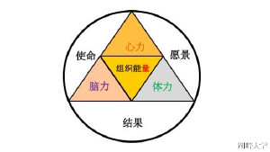

# 湖畔大学

## 彭蕾:组织的心力、脑力、体力
### 战略和文化是什么
战略就是客户价值，让客户爽一点，客户价值就是利益成长体验。
文化就是言行举止。

### 战略文化落地
* 我们要不断追问:我们今天做这件事情，是为了什么！？
* 不仅得意识到 HR 的重要性，而且得和 HR 做一次清晰的交流

### 组织大图

1. 组织的心力，你对创造某一个用户价值之后的一种坚信、一种信念有关。这个心力的部分是非常重要的，使得你可以应对:
   > 最后突然有一天，当你稍微做大一点以后，你对传统行业有冲击，你对于各方面的利益、投资人、消费者、内部的合作伙伴有各种纷争的时候，你的力量、动力来自于哪里？
2. 组织的脑力,
   > 你今天如果不够聪明，包括你的团队如果不够聪明，根本没有办法去对付那么复杂的局面。怎么做呢？最重要的还是回到最根本的地方，就是你问自己的那几个问题：“我的客户价值是什么？”、“我是谁？”、“我从哪来？”、“我要到哪去？”这也是哲学层面的问题。这几个问题，你也可以每天每时每刻问问自己。只有这样子，你脑力的源泉才不会枯竭。
3. 组织的体力,
   > 体力就是执行力。脑力很强，心力也很强，但是最后手和脚跟不上。你的脚迈不开或者迈得很慢，或者你的手动作不够快，跟不上，这个时候没有用，完全没有用。
