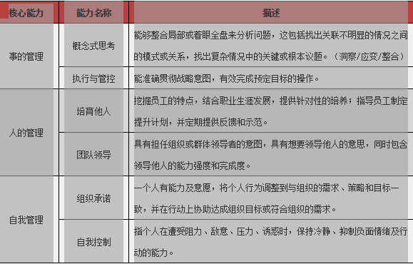

# 选拔培养战略性人才

## 人才能力描述

## 方法步骤
### 初审
由于报名者众多、水平参差不齐，必须设立入选的门槛。初选的要求可根据企业的实际情况确立，如大学本科及以上学历、
任职满三年、近两年绩效至少为良以上等等。
### 综合能力测试
可包含英语测试及能力测试。英语测试分为笔试与面试，能力测试分为通用管理知识和专业知识测试。通过本轮测评后，
优选一批进入下一阶段的选拔。
### 室内拓展
这是选拔过程中非常重要的一环，不能将这一环节作为单纯的单向考核，而须从切实帮助候选人的角度进行规划和设计。
结合能力模型的六个方面，可从团队共识、团队目标、团队沟通与团队建设四个方面规划群体状态下室内拓展培训。
例如：某公司在进行这一环节测试时，候选者中包括40名中层管理人员和40名后备中层管理人员。考虑到这两类人在经验方面的差异，
组织者将80名候选者分成中干和后干两个梯队，通过分组PK，使候选者在长达一天一夜的培训过程中充分展现其在对事、
对人和自我管理三方面的内涵素质。评鉴小组根据六项能力的行为描述进行科学地评定。在这个阶段，
不仅能对候选者的内涵素质进行测评，所有候选者的管理能力同时也都得到了不同程度地提升。

### 角色扮演
虚拟一个公司内部运营的状态，给予候选人不同的管理角色和任务，通过无主持的会议方式，考验他们如何进行有效的会议主持及冲突管理。
评鉴小组作为观察员，对每位候选者所呈现出来的行为进行客观评定。

### 访谈确认
由外部顾问与内部评委组成评审团，根据候选者所表现出来的综合素养，有针对性地进行面谈，并结合之前的评鉴结果进行最终确认。
经过整个选拔流程后，评审团评定出候选人综合素养个人能力报告，以及整体团队的报告和总排序。依据最终评鉴结果，
企业可以挑选出最合适的人才。

##　参考链接
http://mp.weixin.qq.com/s/XA0ZRF1p3MoFslGdPieBCg