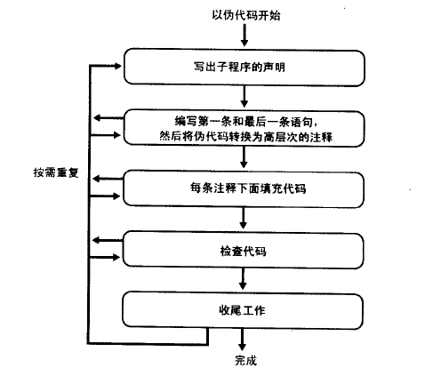

# 伪代码编写过程
> 有助于减少设计与编写文档的工作量

### 创建类与子程序的步骤
#### 创建类的步骤
1. 创建类的总体设计
2. 创建类中的子程序
3. 复审并测试整个类
#### 创建子程序步骤
设计->检查设计->编写子程序->检查子程序

### 伪代码
> 其是指某种用来描述算法、子程序、类或完整程序的工作逻辑的、非形式的、类似于英语的记法  

指导原则：

1. 避免使用目标编程语言的语法元素
2. 使用意图的层面上编写伪代码
3. 在一个足够低的层次上编写伪代码，慢慢加入细节，指导可以直接写出代码

好处：

1. 修改容易
2. 可以作为注释
3. 清晰可迭代
4. 容易评审

### 通过伪代码编程创建子程序
如何设计&设计步骤:  

1. 检查先决条件，是否是必须开发的
2. 定义子程序要解决的问题，包括一系列的判断
3. 为子程序命名，看上去一般是以大写字母开头啊
4. 在标准库中搜索可用的功能 (可大大减少代码量)
5. 考虑错误
6. 考虑效率
7. **研究算法和数据结构**
8. 终于:->编写伪代码
9. 考虑数据
10. 检查伪代码
11. 在伪代码中试验想法，留下最好的想法

### 编写子程序代码
  
其中检查代码其实是一个迭代的过程，伪代码可以分解，此外，也可提炼出子程序。

### 检查代码
这里提供几种检查方式:

1. 在脑海中进行检查，千万不要迷信编译器的错误，1984年才5%
2. 编译子程序。之所以放到这里是因为开始编译之后，你会进入*只要再编译一次我就搞定了*这个怪圈，事实上会产生更多错误，花去更多时间。
   - 编译警告级别调到最高
   - 使用验证工具，如lint
   - 从源头上消灭错误
3. 在调试器中逐行执行代码（简单易行的方法）
4. 测试代码(启用测试框架)
5. 消除程序中的错误（修修补补其实还不如重新写）

### 收尾工作

