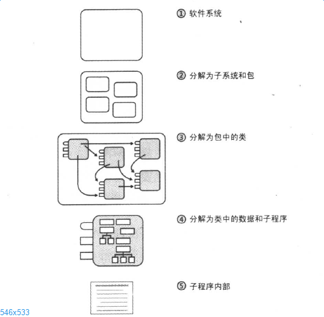

# 构建中的设计
> 如果你认识到设计是一项明确的活动，那么你将获益匪浅。

### 设计常识
* 设计是一个险恶的问题，它可以使得大桥不经意间摧毁(tacoma narrows)
* 设计是一个无章法的过程，设计是无法确定最佳的，一般到了无时间再做了为止就好(想哭有木有/(ㄒoㄒ)/~~)
* 设计是确定取舍和调整顺序的过程,如是要运行快还是运行稳定？
* 设计受到诸多限制，准确的讲，要有限制才能完成设计
* 设计不确定性，有可能有n种方案
* 设计是一个启发性的过程，试试或许就好了，此外当前项目设计不一定适用于其它项目
* 设计是自然而然形成的，所以**不要指望一步到位**

### 设计概念

#### 管理复杂度
1. 偶然的难题与本质的难题，偶然是碰巧，本质是没有就不行，本质性困难的根源在于**复杂性**。
2. 管理复杂度非常重要，毕竟大脑容量有限，拆分为子程序或在抽象层次编程是个好方法
3. 如何面对复杂度,高代价、低效率的的设计源于没有正确认识到复杂度，当你认识到软件开发的任何技术都比不上管理复杂度重要时，
   设计上的考虑就会变得直接了当。方法有:
   - 不要让偶然性复杂度疯长
   - 控制任何人在同一时间需要处理的本质复杂度降到最少

#### 理想的设计特征
1. 最小的复杂度
2. 易于维护
3. 松散耦合
4. 可拓展性
5. 可重用性
6. 高扇入，即辅助类很好的发挥了作用
7. 低扇出，一个类内较少的或适中的使用其他类，高扇出(>7)回是的设计变得复杂
8. 可移植性
9. 精简性，考虑加进来会发生什么问题
10. 层次性，把旧的烂的的代码封闭起来。
11. 标准技术，使用易用的熟悉的方案，是的系统看起来亲切自然。(这一点持保留意见，没有绝对熟悉的方案吧？)

#### 设计的层次
  

