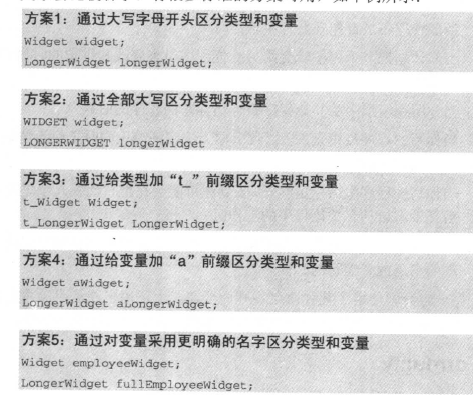

# 变量名的力量
> 这里的命名也适用于类、包、文件..如何为子程序命名可以参考7.3

### 选择好的变量名
好的变量名一眼望去就很有想读的欲望的,而且会一眼就能够使人读懂，当你不知道命名从何入手时，可以从以下几方面考虑:

1. 以问题为导向
2. 考虑最适当的名字长度，一般为(9-16)
3. 考虑作用域，如较短的名字适用于局部变量或循环变量(i)、全局变量较多时尽量使用**命名空间**进行区分
4. 注意将变量赋予主要含义的部分放到最前面(变量名中的计算值限定词)
5. 妥善使用对仗词

### 为特定类型的数据命名
1. 为循环变量命名，相比i来说index或许会更好，此外在循环外要使用时，就不能用ijk了。
2. 为状态变量命名，当你需要猜测某段代码的含义时，那就该考虑重命名
3. 为临时变量命名，需要警惕*temp*
4. 为布尔值变量命名，
   - 谨记典型的布尔值变量名(done、error、found、success)
   - 赋予隐含“真假”含义的名字
   - 使用肯定的布尔变量
5. 为枚举类型命名，可以加组前缀来表名在同一组

### 命名规则的力量
其有助于代码可读性，降低沟通成本，防止名字增生(totalPoint&pointTotal),强调相关变量关联性(如都有同一前缀),那么在何时采用命名规则呢:

1. 多人协作开发
2. 程序交接
3. 需要代码评审
4. 代码规模大
5. 生命周期长
6. 存在不常见术语

### 非正式命名规则
#### 与语言无关规则
1. 区分变量名和子程序名(如一个大写开头一个小写开头)
2. 区分类与对象,以下这几种方式并没有完美方案，需根据实际情况使用  
     
3. 标识全局变量，如以*g_*开头
4. 标识成员变量，如以*m_*开头
5. 标识类型变量，如以*t_color*开头
6. 标识具名常量，如以*c_*开头
7. 标识枚举类型与元素，如以*e_*开头,同时可以为成员名增加前缀如*Color_*
8. 标识只读参数
9. 格式化命名以提高可读性(如下划线*_*命名方式)

#### 与语言相关规则
不同语言有不同的命名规则，这里暂时略过

#### 命名规则实例
看书没看懂时可以看看

### 标准前缀
1. UDT:用户自定义缩写
2. 语言前缀
3. 创建具有可读性的名字
   - **缩写的一般指导原则**
   - 语音缩写(before <-> b4)

### 应该避免的名字
1. 避免无解
2. 避免相似意义
3. 避免不同含义却有相似名字的变量
4. 避免发音相近
5. 避免使用数字
6. 避免拼错
7. 避免使用大小写区分变量(特别是Javascript)
8. 避免多种自然语言
9. 避免使用标准类型、变量和子程序名字
10. 不要使用与变量含义无关的事情
11. 避免在名字中使用混淆字符

