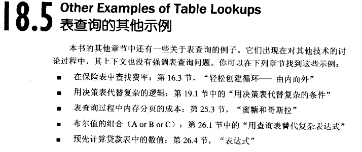

# 表驱动法
> 凡是可以通过逻辑语句来选择的事物，都可以通过查表选择

## 表驱动法使用总则
两个问题:

1. 怎样从表中查找数目(直接/索引/阶梯)
2. 应该在表里存什么(数据/动作) 

## 直接访问表
其实很多情况下表选择都不易出错，且易于维护，千万不要生搬硬套面向对象方法，有时候会使得程序变得异常复杂。

### 构建键值
1. 复制信息从而能够直接使用键值
2. 转换键值使得其可以直接访问
3. 把键值转换为子程序

## 索引访问表
1. 节省内存空间
2. 即使没有节省内存空间其操作也比主表更廉价

## 阶梯访问表
其比较适应概率类查询。  
### 需要注意的一些细节
1. 注意端点(> & >=)
2. **考虑二分法取代顺序查找**
3. 考虑索引访问来取代阶梯技术
4. 把阶梯查询操作提取出单独的子程序

## 表查询中其它示例
  
### 附件
核对表(驱动法)