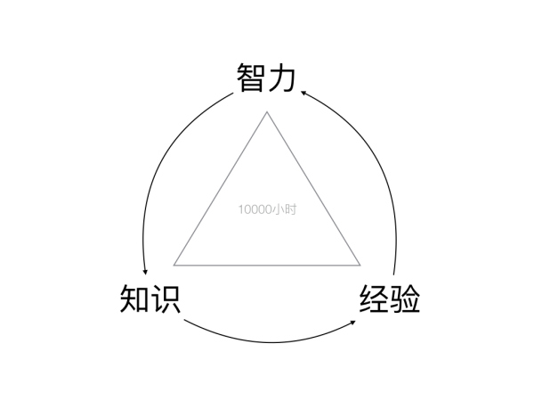
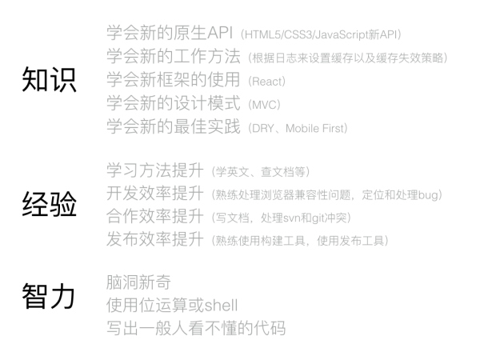
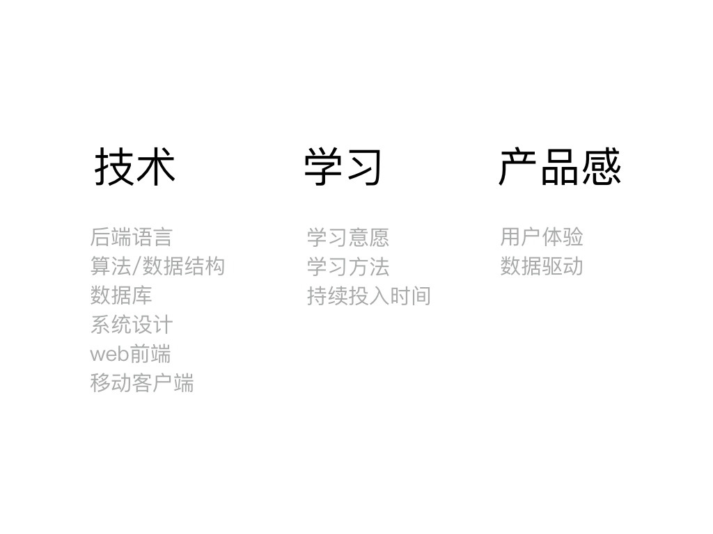

# 余果
> 关注余果一年多了，关注他博客，也加了他的群。

## 文章笔记
### 《面向未来的跨界开发技术(上)》
1. 在 Google Trends 中输入需要调查的技术关键词 tutorial。
   这个方法样能反映英语世界中的开发者对特定技术的学习热情，也就能相对客观地反映出未来趋势 
2. 关于 智力 vs 经验 vs 知识  
     
     

#### 总结
要学会搜集信息与分析信息，此外，10000小时定律不是待在舒适区单纯的重复，而应该持之以恒的学习新事物(实践+练习)

### 《面向未来的跨界开发技术(下)》  
1. "算法和数据结构"应该是基础内功，没有内功，只剩招数，无法成为绝世高手。很多自学成才的前端不理解算法，可能会写出渲染性能很糟糕的网站。
2. 技术 vs 学习 vs 产品感      
     
3. 重点介绍了hybrid app/react-native、mongodb...
4. 给腾讯云打点广告