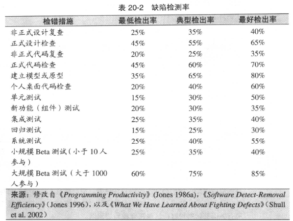

# 软件质量概述

## 软件质量特性
分为内在和外在，外在特性(强调使用)是指用户所能感知到的，包括

1. 正确
2. 可用，学习容易
3. 效率，尽量不占用系统资源
4. 可靠，平均无故障时间
5. 完整，确保数据能正确访问
6. 适用，不同环境能运行
7. 精确，误差小
8. 健壮，有压力环境下能正常运行

内在特性包括(强调维护，注意可能与外在特性有重叠):

1. 可维护性
2. 灵活性
3. 可移植性
4. 可重用性
5. 可读性
6. 可测试性
7. 可理解性  

此外各个特性之间存在相互影响。

## 改善软件质量的技术
1. 明确软件质量目标
2. 明确定义质量保证工作(否则胡乱堆砌也没有不对)
3. 测试策略
4. 软件工程指南
5. 非正式技术复查
6. 正式技术复查外部审查 

### 开发过程
* 对变更进行控制，否则会失控，出现自我矛盾。
* 对结果的量化
* 制作原型(有这个更能贴近用户需求)

### 设置目标
设置不同的目标得到的各特性评分会有很大差异。

## 不同质量保障技术相对效能

### 缺陷检测率
最好组合使用以下几种方案，以求达到较高的检测率
   

### 成本
一般自个检查代码会比使用测试检测效率好很多。
可以按以下步骤进行:  

1. 对所有需求、系统架构、系统关键部分进行检测
2. 建模（原型）
3. 代码阅读/自我检测
4. 测试

## 什么时候进行质量保证工作
答案是尽可能早...

## 软件质量的普遍原理
> 每人每天最终的交付效率是10~50行代码  

缺陷最多的不是编程最快也编程不是最慢。 :)~~~

保证软件质量并不会增加总成本！！！

### 附件
核对表(质量保证计划)