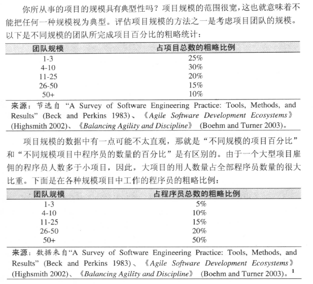

# 程序规模对构建的影响
> 项目的增大往往意味着失控，代码量增大n倍，工作量可能比n倍多很多。

## 交流和规模
文档才是王道，否则会失控

## 项目规模范围

## 项目规模对错误的影响
一般情况下，项目规模越大，每千行错误也就越多。

## 项目规模对生产效率的影响
项目规模越小生产效率就越高

## 项目规模对开发活动的影响
需要着重了解 程序->产品->系统 三种之间的区别，程序员用开发程序的逻辑来评估一个系统，
可能会低估10倍！程序花的的时间远远不仅仅是构建！

### 方法论和规模
作者重点提到了文档，项目规模越大，写文档占用的时间就越长！  
注意确定好项目的规模，然后选择好恰当的方法论。

