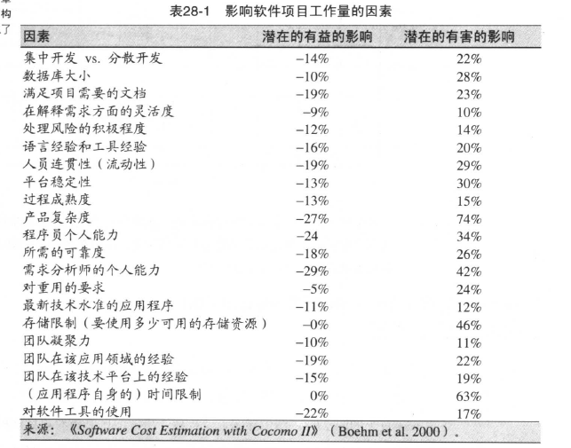

# 管理构建

## 鼓励良好的编码实践
在软件项目中，专家层起的作用与管理者起的作用几乎相同。但是专家最好是一线编程人员，否则程序员会怨恨其不懂。

1. 设定编码标准
2. 鼓励良好的编码实践技术
   - 两人一起编码
   - 逐行审查代码
   - 要求代码签名
   - 安排好的代码供人参考
   - 强调代码是公共财产
   - 奖励好的代码
   - 一份简单的标准

## 配置管理

### 需求变更和设计变更
1. 遵循变更手续
2. 成组处理变更(可以从整体角度判断)
3. 评估成本
4. 提防大量变更需求
5. 成立变更委员会或者类似机构
6. 警惕官僚主义，针对(5)而言

### 软件变更
其实就是版本管理软件，如svn/git  

### 其它
1. 工具版本
2. 机器配置
3. 备份计划

## 评估构建进度表
开发人员评估值一般比构建进度要乐观20%-30%  
一般的影响因素有这些:  

除以上之外，还包括很多不可量化的因素:  团队/管理/需求变更/客户参与程度 等  

### 评估与控制
如果落后了怎么办

1. 希望自己可以赶上（哈哈 这是什么鬼）
2. 扩充团队(如果项目不可分割，增加人手只会减慢进度)
3. 缩减项目范围

## 度量
度量总比不度量好。 此外  

1. 留心度量的副作用
2. 项目的最后期限永远比数据收集更重要

## 把程序员当人看

### 明了程序员怎么花掉时间
走路原来有这么长 6%的时间花在走路上。  
个人觉得这种统计有点扯，不过有这个意识还是很有必要的。

### 性能差异与质量差异
包括个人差异与团队差异(真的非常大！)  

### 信仰问题
尊重就好！

### 物理环境
原来物理环境变好可以如此大的提高生产(有机会带来100%的提升)  

## 管理你的管理者
技术出色且与时代与时俱进的管理者真的是凤毛麟角
你可以有如下应对措施:  

1. 先把想法藏起来，等着头脑风暴或者集体讨论
2. 把正确的思想传递给你的管理者
3. 关注你管理者的兴趣
4. 拒绝按你管理者的说法去做
5. 换个工作吧(哈哈哈)
